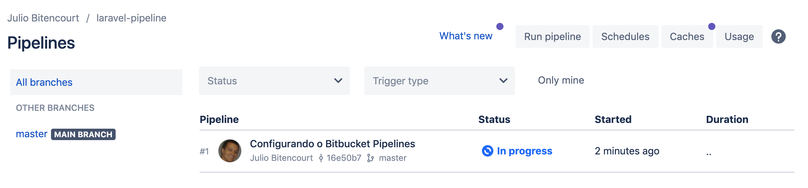

Continuous integration is a widespread practice in the software development industry.

And today you will learn a way to do **continuous integration in Laravel projects** with Bitbucket Pipelines.

Bitbucket Pipelines is the tool for integration and continuous deployment of the Git Bitbucket cloud platform.

In the free plan of the tool you have 50 minutes of build, which is the time spent to execute the continuous integration processes. That is, you can start using this very useful tool right now.

To run this tutorial you will need a basic understanding of:

- Git
- Terminal (Linux, Windows or Mac)
- Laravel

## So let's see how to do continuous integration with Laravel

After creating a Bitbucket account, create a new repository. For this tutorial we will call it **laravel-pipeline**.

<div class="mx-auto w-6/12 border-solid border-2 border-gray-600">


</div>


After creating the repository in bitbucket, clone it in your development environment.

```shell
$ git clone git@bitbucket.org:your-username/laravel-pipeline.git
```

Access the repository folder, add the remote and send the master branch to Bitbucket.

```shell
$ cd laravel-pipeline
$ git remote add origin git@bitbucket.org:your-username/laravel-pipeline.git
$ git push -u origin master
```

## Installing Laravel

We will use the [Laravel installer](https://laravel.com/docs/8.x) to create a new Laravel application.

Still in the laravel-pipeline folder type.

```shell
$ laravel new
```

After installing Laravel, run the automated tests that are included in the standard installation.

To do this, just type in the terminal:

```shell
$ artisan test
```


Now let's do an initial commit and send the code to the repository on Bitbucket

```shell
$ git add .
$ git commit -m "Installing Laravel"
$ git push
```

Done! Our code is already in Bitbucket and now we can start to configure the pipeline.

## Configuring the repository for continuous integration in Bitbucket Pipelines

Access the repository settings and then the Pipeline settings.


Then activate the Pipeline.


Notice in the image above that now we need to configure the file **bitbucket-pipelines.yml**

## Bitbucket Pipelines configuration files

We need to configure two files in Bitbucket: **bitbucket-pipelines.yml** and **.env.pipelines**.

### The file bitbucket-pipelines.yml

Templates
6-language-templates

Bitbucket provides several configuration templates for the most diverse development environments.

You can consult the various options to understand how they work. But in this tutorial we will create the file manually to practice well.

In your preferred editor create the file **bitbucket-pipelines.yml** at the root of the project, that is, in the folder **laravel-pipeline**.

Bitbucket-pipelines.yml, as the extension already shows, is a [YAML file] (https://yaml.org/). You don't need a lot of experience in this type of file right now as it is very simple to understand.

```yaml
image: php:7.4-fpm
pipelines:
  default:
    - step:
        name: Build and test
        caches:
          - composer
        script:
          - apt-get update && apt-get install -qy git curl libmcrypt-dev mariadb-client ghostscript
          - yes | pecl install mcrypt-1.0.3
          - docker-php-ext-install pdo_mysql bcmath exif
          - curl -sS https://getcomposer.org/installer | php -- --install-dir=/usr/local/bin --filename=composer
          - composer install
          - ln -f -s .env.pipelines .env
          - php artisan migrate
          - ./vendor/bin/phpunit
        services:
          - mysql
          - redis
definitions:
  services:
    mysql:
      image: mysql:5.7
      environment:
        MYSQL_DATABASE: 'laravel-pipeline'
        MYSQL_RANDOM_ROOT_PASSWORD: 'yes'
        MYSQL_USER: 'homestead'
        MYSQL_PASSWORD: 'secret'
    redis:
      image: redis
```

### Understanding the bitbucket-pipelines.yml file

Bitbucket Pipelines uses **Docker containers** to perform the steps. The bitbucket-pipelines.yml file is the main configuration file for this automated flow.

In the first line of the file we see that we will use a **docker image for PHP 7.4 with PHP-FPM configured**.

```yaml
image: php:7.4-fpm
```

In our example file we have two main sections: **pipelines** and **definitions**. Let's start with **pipelines**.

This section defines which pipelines are defined for this repository. **default** will be performed for all branches.

Each **- step** is an isolated step in the flow. The steps can exchange _state_ with each other, but this configuration is out of scope in this tutorial.

In the step we define: **name, caches, script and services**.

- **name** - is the name that will be displayed in the pipeline execution interface
- **caches** - we configure the composer cache so that subsequent pipeline runs are faster
- **scripts** - is where the magic happens. I will explain further below
- **services** - are the services needed to use the pipeline. In this case MySQL and Redis. The services will be explained later in this tutorial

Remembering that this is a basic configuration and it is possible to do much more with Bitbucket Pipelines. Including automatic deployment, as we will see in a future file.

I suggest you consult the documentation on the official website.

### Running the scripts in the Docker container

First we update the Docker image packages and install the **git, curl, libmcrypt-dev, mariadb-client, ghostscript and mcrypt** packages

- apt-get update && apt-get install -qy git curl libmcrypt-dev mariadb-client ghostscript
- yes | pecl install mcrypt-1.0.3

We now use the **docker-php-ext-install** tool to install the **pdo_mysql, bcmath and exif** extensions that are required for this version of Laravel.

- docker-php-ext-install pdo_mysql bcmath exif

Then we use **curl** to download composer and install the dependencies of our Laravel project with the command **composer install**

- curl -sS https://getcomposer.org/installer | php -- --install-dir=/usr/local/bin --filename=composer
- composer install

And last but not least, we created a symbolic link between **.env.pipelines** and the standard **.env** that will be used by Laravel during the execution of automated tests.

Then we ran the migrations and the test suite.

```shell
ln -f -s .env.pipelines .env
php artisan migrate
./vendor/bin/phpunit
```

### Defining the services to be installed through Docker containers

```yaml
definitions:
  services:
    mysql:
      image: mysql:5.7
      environment:
        MYSQL_DATABASE: 'laravel-pipeline'
        MYSQL_RANDOM_ROOT_PASSWORD: 'yes'
        MYSQL_USER: 'homestead'
        MYSQL_PASSWORD: 'secret'
    redis:
      image: redis
```

With the **bitbucket-pipelines.yml** file configured, all that remains now is to configure an accessory file with the environment variables that will be used by the service during the execution of the steps

### The file .env.pipelines

```
APP_ENV=local
APP_KEY=ThisIsThe32CharacterKeySecureKey
APP_DEBUG=true
DB_CONNECTION=mysql
DB_HOST=127.0.0.1
DB_DATABASE=laravel-pipeline
DB_USERNAME=homestead
DB_PASSWORD=secret
```

This file defines the environment variables that will be used specifically for the execution of the pipeline.

Git Status

```shell
$ git add .
$ git commit -m "Configuring Bitbucket Pipelines"
$ git push
```

From the moment the code is sent to the repository, Bitbucket Pipelines will identify this action and start the build process.

When accessing the Pipelines menu you will see that the pipeline is being executed for the commit that we created earlier. In this case, "Configuring Bitbucket Pipelines".




Click on the pipeline status and you will see the screen with all the steps being performed.

Menu Pipelines

If everything went well, the build will be green


## Now how about inserting an error in our code and sending it to the repository?

Let's force an error in our automated test.

Open the ExampleTest.php file located in the tests / Unit directory and change line 16 as shown below.

```php
$this->assertTrue(false);
```

Now commit and upload to the repository.

```shell
$ git add .
$ git commit -m "My amazing functionality"
$ git push
```

After a few moments the pipeline will be executed automatically and when running the test suite it will fail.


## Conclusion

In this article we saw that with a little initial setup we can save a lot of time in locating and correcting errors in the future.

If you encountered any problems or have any suggestions please leave a comment and if possible share this article with your devs friends!